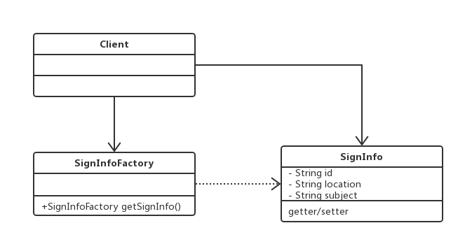
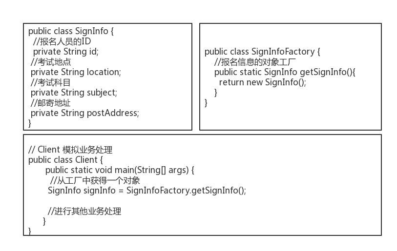
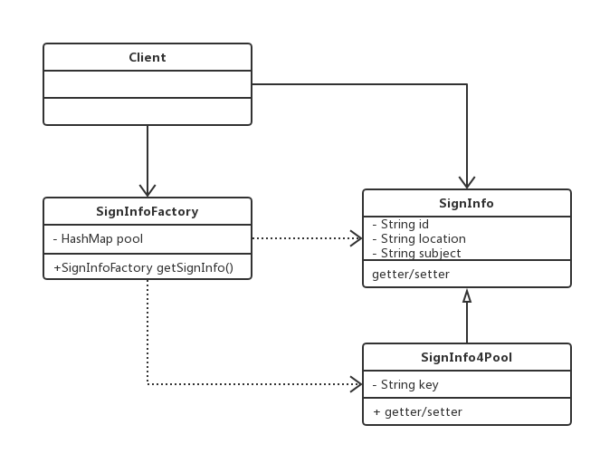
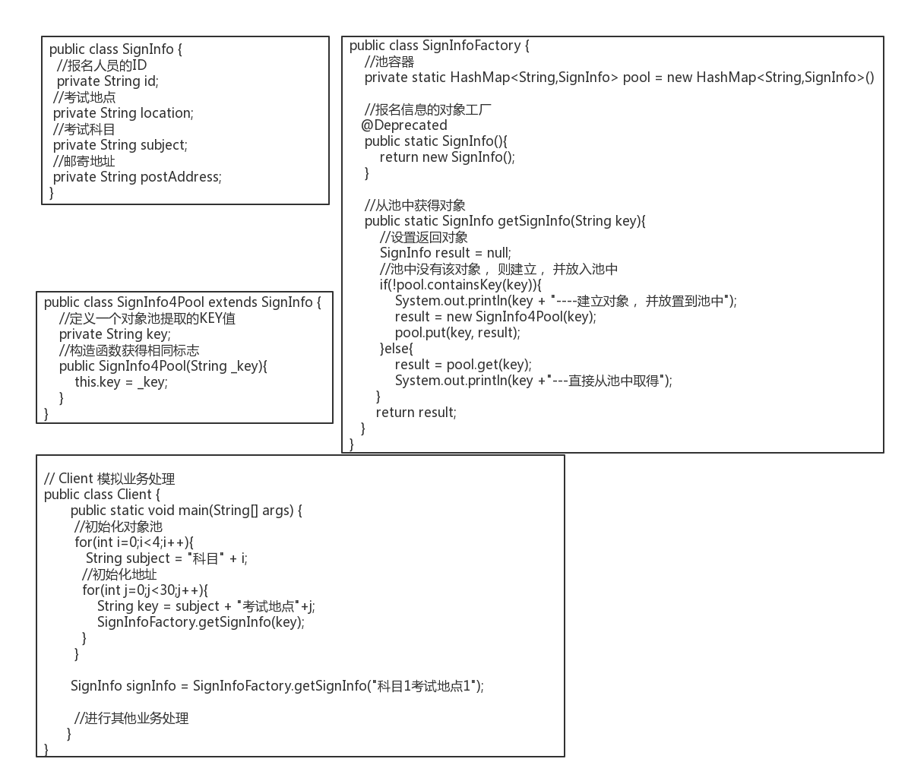

# 案例

某个报考系统， 其中有一个模块负责社会人员报名， 该模块对全国的考试人员只开放3天， 并且限制报考人员数量。 第一天9点开始报考， 系统慢得像蜗牛， 基本上都不能访问， 后来设置了HTTP Server的并发数量， 稍
有缓解， 40分钟后宕了一台机器， 10分钟后， 又挂了一台， 下午又挂了一台。问题定位：`内存溢出`。系统部署及并发情况如下：

* 该系统部署了8台服务器
* HTTP的最大并发为2000，平均到每台服务器，压力不太大

出现内存溢出，有两种可能：

* 内存泄露
* 对象太多

接下来说下， 基本业务流程，先注册，然后再登录。登录后填写的信息如下：

* 考试科目，选择框
* 考试地点，选择框，根据科目不同，列表不同
* 准考证邮寄地址，输入框

其他信息就不列出，就以这三个为代表讲解。信息填完后，点击确认报名就结束了，后台就是一个持久化操作。那为什么会出现服务器一台接着一台的挂了呢？首先将上述过程使用静态类图画出来

代码简单实现如下：

就这么简单，为什会出现为问题呢？系统厂商提供分析报告如下：

**内存突然由800MB飙升到1.4GB， 新的对象申请不到内存空间， 于是出现OutOfMemory， 同时报
告中还列出宕机时刻内存中的对象， 其中SignInfo类的对象就有400MB**

从报告中可以看出，在高并发的作用下，SignInfo类的对象创建了很多，最终导致了内存溢出。

既然问题找到了，如何解决呢？

### 解决思路：

在几十万个SignInfo对象中，考试科目只有4个，考试地点也就30多个，其他属性每个对象都是不相同。考虑将相同属性提出来，不同的属性在业务处理过程进行赋值，也就是按照考试科目和考试地点进行组合，预先创建出120多个对象，放入到池（对象池）中。每次按需从池中获取即可。类图实现如下：

代码实现如下：

